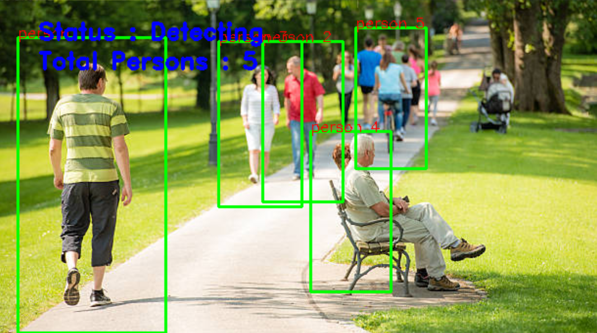

# 👥 Real-Time Human Detection & Counting

A project using Python, OpenCV, and HOG (Histogram of Oriented Gradients) to detect and count humans in real-time from a webcam, video file, or image. This project demonstrates how to build a human detection and counting system using the HOG descriptor with a pre-trained SVM model provided by OpenCV. It processes image frames to identify people, draws bounding boxes, and displays the total count in real time.



---

## 🎯 Features
- Real-time detection and counting via webcam
- Frame-by-frame detection in video
- Static image processing
- Live bounding box rendering and status display
- Optional video output saving

--- 

## 🧠 How It Works
- HOG Descriptor + SVM: Used to identify people in image frames.
- detect() Function: Processes frames, detects people, draws bounding boxes, and displays count.
- Flexible Input: Accepts image files, video files, or live webcam feed.
- Command-line Interface: Controlled via argparse for input type selection and output saving.

---

## 🛠️ Technologies Used

- **Python**
- **OpenCV**: For computer vision tasks
- **Imutils**: Simplifies image processing
- **NumPy**: For scientific computations
- **Argparse**: For parsing command-line arguments

---

## 📦 Installation

Install the required dependencies using `pip`:

```bash
pip install opencv-python imutils numpy
```

---

## 🚀 How to Run

### 1. Detect humans from a video file:
```bash
python human-counting-project-code.py -v "path/to/video.mp4"
```
### 2. Detect humans from an image:
```bash
python human-counting-project-code.py -i "path/to/image.jpg"
```

### 3. Use the webcam for real-time detection:
```bash
python human-counting-project-code.py -c True
```

### 4. Save the output to a file:
```bash
python human-counting-project-code.py -c True -o "output.avi"
```

Press 'q' during runtime to exit the webcam or video detection mode.

---

# Credits
Created by Louis Nguyen
